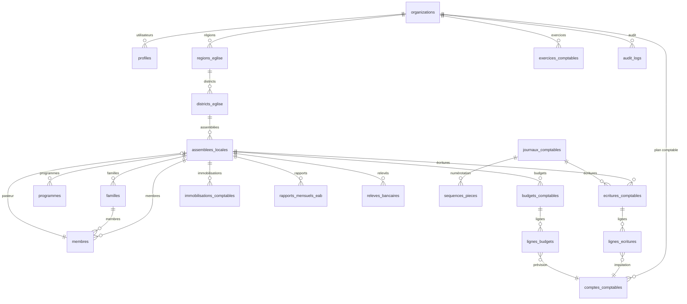

# 📘 BACKEND_REFERENCE.md — Référence Complète du Backend EAB

> [!CAUTION]
> ## ⚠️ LECTURE ET MISE À JOUR OBLIGATOIRES
> Ce fichier est la **source de vérité unique** pour le backend Supabase du projet EAB.
> **Toute modification du backend** (tables, colonnes, RLS, fonctions, triggers, index, storage)
> **DOIT être reflétée ici AVANT de commiter.**
> Ne JAMAIS se fier uniquement aux fichiers de migration — ce document reflète l'état RÉEL.

- **Projet** : EAB (Église–Administration–Budget)
- **Backend** : Supabase (PostgreSQL)
- **Dernière mise à jour** : 2026-02-23
- **Fichiers de migration** : `supabase/migrations/00001` → `00008`

---

## Table des matières

1. [Types / Enums](#1-types--enums)
2. [Tables — Structure ecclésiastique](#2-tables--structure-ecclésiastique)
3. [Tables — Comptabilité (SYCEBNL)](#3-tables--comptabilité-sycebnl)
4. [Tables — Améliorations (exercices, audit, séquences)](#4-tables--améliorations)
5. [Clés primaires et étrangères](#5-clés-primaires-et-étrangères)
6. [Contraintes](#6-contraintes)
7. [Politiques RLS](#7-politiques-rls)
8. [Fonctions PostgreSQL](#8-fonctions-postgresql)
9. [Triggers](#9-triggers)
10. [Index](#10-index)
11. [Vues](#11-vues)
12. [Storage Buckets](#12-storage-buckets)
13. [Extensions](#13-extensions)
14. [Diagramme de dépendances](#14-diagramme-de-dépendances)
15. [Journal des modifications](#15-journal-des-modifications)

---

## 1. Types / Enums

| Nom | Valeurs | Source |
|-----|---------|--------|
| `gender` | `male`, `female` | 00001 |
| `statut_matrimonial` | `celibataire`, `marie`, `veuf`, `veuve`, `divorce`, `separe` | 00001 |
| `statut_fidele` | `actif`, `inactif`, `parti`, `decede`, `transfere` | 00001 |
| `role_fidele` | `membre`, `pasteur`, `ancien`, `diacre`, `diaconesse`, `evangeliste`, `autre_officier` | 00001 |
| `vulnerabilite_fidele` | `orphelin`, `veuf`, `veuve`, `handicape`, `troisieme_age`, `autre` | 00001 |
| `type_programme` | `culte`, `evangelisation_masse`, `evangelisation_porte_a_porte`, `baptemes`, `mains_association`, `sainte_cene`, `reunion_priere`, `mariage`, `discipline`, `visite`, `ecole_du_dimanche`, `autre` | 00001 |
| `type_visite` | `fidele`, `autorite`, `partenaire`, `autre_assemblee`, `autre` | 00001 |
| `role_utilisateur` | `admin_national`, `responsable_region`, `surintendant_district`, `tresorier_assemblee` | 00001 |
| `nature_compte` | `actif`, `passif`, `charge`, `produit`, `hors_activite_ordinaire`, `engagement`, `autre` | 00002 |
| `type_journal_comptable` | `caisse`, `banque`, `operations_diverses` | 00002 |
| `type_tiers` | `membre`, `fournisseur`, `bailleur`, `employe`, `partenaire`, `autre` | 00002 |
| `type_centre_analytique` | `assemblee_locale`, `projet`, `activite`, `departement`, `autre` | 00002 |
| `mode_paiement` | `especes`, `cheque`, `virement_bancaire`, `mobile_money`, `microfinance`, `autre` | 00002 |
| `type_immobilisation` | `terrain`, `batiment`, `mobilier`, `materiel_informatique`, `materiel_sono`, `vehicule`, `autre` | 00002 |
| `statut_ecriture` | `brouillon`, `validee`, `cloturee` | 00002 |
| `action_audit` | `INSERT`, `UPDATE`, `DELETE`, `SOFT_DELETE`, `LOGIN`, `LOGOUT`, `VALIDATION`, `CLOTURE` | 00007 |

---

## 2. Tables — Structure ecclésiastique

### 2.1 `organizations`
> Multi-tenancy. Chaque église/organisation a son espace isolé.

| Colonne | Type | Nullable | Défaut | Description |
|---------|------|----------|--------|-------------|
| `id` | UUID | NON | `uuid_generate_v4()` | PK |
| `name` | TEXT | NON | — | Nom de l'organisation |
| `code` | TEXT | OUI | — | Code unique (UNIQUE) |
| `description` | TEXT | OUI | — | Description |
| `logo_url` | TEXT | OUI | — | URL du logo |
| `created_at` | TIMESTAMPTZ | NON | `NOW()` | Date de création |
| `updated_at` | TIMESTAMPTZ | NON | `NOW()` | Dernière modification |

**RLS** : ✅ activé — **UNIQUE** : `code`

---

### 2.2 `profiles`
> Profil utilisateur avec rôle et périmètre d'accès. Lié à `auth.users`.

| Colonne | Type | Nullable | Défaut | Description |
|---------|------|----------|--------|-------------|
| `id` | UUID | NON | — | PK, FK → `auth.users(id)` ON DELETE CASCADE |
| `organization_id` | UUID | OUI | — | FK → `organizations(id)` ON DELETE SET NULL |
| `full_name` | TEXT | NON | — | Nom complet |
| `role` | `role_utilisateur` | NON | `'tresorier_assemblee'` | Rôle utilisateur |
| `id_region` | UUID | OUI | — | FK → `regions_eglise(id)` ON DELETE SET NULL |
| `id_district` | UUID | OUI | — | FK → `districts_eglise(id)` ON DELETE SET NULL |
| `id_assemblee_locale` | UUID | OUI | — | FK → `assemblees_locales(id)` ON DELETE SET NULL |
| `avatar_url` | TEXT | OUI | — | URL de l'avatar |
| `created_at` | TIMESTAMPTZ | NON | `NOW()` | — |
| `updated_at` | TIMESTAMPTZ | NON | `NOW()` | — |

**RLS** : ✅ activé

---

### 2.3 `regions_eglise`
> Régions ecclésiastiques au niveau national.

| Colonne | Type | Nullable | Défaut | Description |
|---------|------|----------|--------|-------------|
| `id` | UUID | NON | `uuid_generate_v4()` | PK |
| `organization_id` | UUID | NON | — | FK → `organizations(id)` ON DELETE CASCADE |
| `nom` | TEXT | NON | — | Nom de la région |
| `code` | TEXT | OUI | — | Code région |
| `description` | TEXT | OUI | — | — |
| `created_at` | TIMESTAMPTZ | NON | `NOW()` | — |
| `updated_at` | TIMESTAMPTZ | NON | `NOW()` | — |

**RLS** : ✅ — **UNIQUE** : `(organization_id, code)`

---

### 2.4 `districts_eglise`
> Districts au sein d'une région.

| Colonne | Type | Nullable | Défaut | Description |
|---------|------|----------|--------|-------------|
| `id` | UUID | NON | `uuid_generate_v4()` | PK |
| `organization_id` | UUID | NON | — | FK → `organizations(id)` ON DELETE CASCADE |
| `id_region` | UUID | NON | — | FK → `regions_eglise(id)` ON DELETE CASCADE |
| `nom` | TEXT | NON | — | Nom du district |
| `code` | TEXT | OUI | — | Code district |
| `description` | TEXT | OUI | — | — |
| `created_at` | TIMESTAMPTZ | NON | `NOW()` | — |
| `updated_at` | TIMESTAMPTZ | NON | `NOW()` | — |

**RLS** : ✅ — **UNIQUE** : `(organization_id, code)`

---

### 2.5 `assemblees_locales`
> Assemblées locales (églises locales).

| Colonne | Type | Nullable | Défaut | Description |
|---------|------|----------|--------|-------------|
| `id` | UUID | NON | `uuid_generate_v4()` | PK |
| `organization_id` | UUID | NON | — | FK → `organizations(id)` ON DELETE CASCADE |
| `id_district` | UUID | NON | — | FK → `districts_eglise(id)` ON DELETE CASCADE |
| `nom` | TEXT | NON | — | Nom de l'assemblée |
| `code` | TEXT | OUI | — | Code assemblée |
| `ville` | TEXT | OUI | — | Ville |
| `quartier` | TEXT | OUI | — | Quartier |
| `adresse_postale` | TEXT | OUI | — | Adresse postale |
| `telephone` | TEXT | OUI | — | Téléphone |
| `email` | TEXT | OUI | — | Email |
| `id_fidele_pasteur_responsable` | UUID | OUI | — | FK → `membres(id)` ON DELETE SET NULL |
| `created_at` | TIMESTAMPTZ | NON | `NOW()` | — |
| `updated_at` | TIMESTAMPTZ | NON | `NOW()` | — |

**RLS** : ✅ — **UNIQUE** : `(organization_id, code)`

---

### 2.6 `familles`
> Familles de fidèles pour le suivi familial.

| Colonne | Type | Nullable | Défaut | Description |
|---------|------|----------|--------|-------------|
| `id` | UUID | NON | `uuid_generate_v4()` | PK |
| `organization_id` | UUID | NON | — | FK → `organizations(id)` ON DELETE CASCADE |
| `id_assemblee_locale` | UUID | OUI | — | FK → `assemblees_locales(id)` ON DELETE SET NULL |
| `nom` | TEXT | NON | — | Nom de famille |
| `id_epoux` | UUID | OUI | — | FK → `membres(id)` ON DELETE SET NULL |
| `id_epouse` | UUID | OUI | — | FK → `membres(id)` ON DELETE SET NULL |
| `deleted_at` | TIMESTAMPTZ | OUI | — | Soft delete (00007) |
| `created_at` | TIMESTAMPTZ | NON | `NOW()` | — |
| `updated_at` | TIMESTAMPTZ | NON | `NOW()` | — |

**RLS** : ✅

---

### 2.7 `membres`
> Membres/fidèles de l'église avec toutes leurs informations.

| Colonne | Type | Nullable | Défaut | Description |
|---------|------|----------|--------|-------------|
| `id` | UUID | NON | `uuid_generate_v4()` | PK |
| `organization_id` | UUID | NON | — | FK → `organizations(id)` ON DELETE CASCADE |
| `id_assemblee_locale` | UUID | OUI | — | FK → `assemblees_locales(id)` ON DELETE SET NULL |
| `id_famille` | UUID | OUI | — | FK → `familles(id)` ON DELETE SET NULL |
| `full_name` | TEXT | NON | — | Nom complet |
| `gender` | `gender` | NON | — | Genre |
| `date_naissance` | DATE | OUI | — | Date de naissance |
| `phone` | TEXT | OUI | — | Téléphone |
| `email` | TEXT | OUI | — | Email |
| `address` | TEXT | OUI | — | Adresse |
| `statut_matrimonial` | `statut_matrimonial` | OUI | — | Statut matrimonial |
| `date_conversion` | DATE | OUI | — | Date de conversion |
| `date_bapteme` | DATE | OUI | — | Date de baptême |
| `date_main_association` | DATE | OUI | — | Date main d'association |
| `statut` | `statut_fidele` | NON | `'actif'` | Statut du fidèle |
| `role` | `role_fidele` | NON | `'membre'` | Rôle dans l'église |
| `date_entree` | DATE | OUI | — | Date d'entrée |
| `date_sortie` | DATE | OUI | — | Date de sortie |
| `motif_sortie` | TEXT | OUI | — | Motif de sortie |
| `date_deces` | DATE | OUI | — | Date de décès |
| `vulnerabilites` | JSONB | OUI | `'[]'` | Liste des vulnérabilités |
| `photo_url` | TEXT | OUI | — | URL de la photo |
| `deleted_at` | TIMESTAMPTZ | OUI | — | Soft delete (00007) |
| `created_at` | TIMESTAMPTZ | NON | `NOW()` | — |
| `updated_at` | TIMESTAMPTZ | NON | `NOW()` | — |

**RLS** : ✅

---

### 2.8 `programmes`
> Activités et programmes de l'église (cultes, évangélisations, etc.).

| Colonne | Type | Nullable | Défaut | Description |
|---------|------|----------|--------|-------------|
| `id` | UUID | NON | `uuid_generate_v4()` | PK |
| `organization_id` | UUID | NON | — | FK → `organizations(id)` ON DELETE CASCADE |
| `id_assemblee_locale` | UUID | OUI | — | FK → `assemblees_locales(id)` ON DELETE SET NULL |
| `type` | `type_programme` | NON | — | Type de programme |
| `date` | DATE | NON | — | Date du programme |
| `location` | TEXT | NON | — | Lieu |
| `description` | TEXT | OUI | — | Description |
| `observations` | TEXT | OUI | — | Observations |
| `participant_ids` | JSONB | OUI | `'[]'` | IDs des participants |
| `type_visite` | `type_visite` | OUI | — | Type de visite |
| `compte_rendu_visite` | TEXT | OUI | — | Compte rendu |
| `nombre_hommes` | INTEGER | OUI | `0` | Nb hommes présents |
| `nombre_femmes` | INTEGER | OUI | `0` | Nb femmes présentes |
| `nombre_garcons` | INTEGER | OUI | `0` | Nb garçons présents |
| `nombre_filles` | INTEGER | OUI | `0` | Nb filles présentes |
| `conversions_hommes` | INTEGER | OUI | `0` | Conversions hommes |
| `conversions_femmes` | INTEGER | OUI | `0` | Conversions femmes |
| `conversions_garcons` | INTEGER | OUI | `0` | Conversions garçons |
| `conversions_filles` | INTEGER | OUI | `0` | Conversions filles |
| `nombre_classes_ecole_dimanche` | INTEGER | OUI | `0` | Nb classes école dimanche |
| `nombre_moniteurs_hommes` | INTEGER | OUI | `0` | Nb moniteurs hommes |
| `nombre_monitrices_femmes` | INTEGER | OUI | `0` | Nb monitrices femmes |
| `derniere_lecon_ecole_dimanche` | TEXT | OUI | — | Dernière leçon |
| `deleted_at` | TIMESTAMPTZ | OUI | — | Soft delete (00007) |
| `created_at` | TIMESTAMPTZ | NON | `NOW()` | — |
| `updated_at` | TIMESTAMPTZ | NON | `NOW()` | — |

**RLS** : ✅

---

## 3. Tables — Comptabilité (SYCEBNL)

### 3.1 `comptes_comptables`
> Plan comptable conforme SYCEBNL.

| Colonne | Type | Nullable | Défaut | Description |
|---------|------|----------|--------|-------------|
| `id` | UUID | NON | `uuid_generate_v4()` | PK |
| `organization_id` | UUID | NON | — | FK → `organizations(id)` CASCADE |
| `numero` | TEXT | NON | — | Numéro du compte (ex: "5121") |
| `intitule` | TEXT | NON | — | Libellé du compte |
| `nature` | `nature_compte` | NON | — | Nature comptable |
| `niveau` | INTEGER | OUI | `1` | 1=classe, 2=compte, 3=sous-compte |
| `id_compte_parent` | UUID | OUI | — | FK → `comptes_comptables(id)` SET NULL |
| `actif` | BOOLEAN | NON | `TRUE` | Compte actif |
| `created_at` / `updated_at` | TIMESTAMPTZ | NON | `NOW()` | — |

**RLS** : ✅ — **UNIQUE** : `(organization_id, numero)`

---

### 3.2 `journaux_comptables`
> Journaux comptables (caisse, banque, OD).

| Colonne | Type | Nullable | Défaut | Description |
|---------|------|----------|--------|-------------|
| `id` | UUID | NON | `uuid_generate_v4()` | PK |
| `organization_id` | UUID | NON | — | FK → `organizations(id)` CASCADE |
| `code` | TEXT | NON | — | Code journal (ex: "CAI", "BAN") |
| `intitule` | TEXT | NON | — | Libellé |
| `type` | `type_journal_comptable` | NON | — | Type de journal |
| `actif` | BOOLEAN | NON | `TRUE` | Journal actif |
| `created_at` / `updated_at` | TIMESTAMPTZ | NON | `NOW()` | — |

**RLS** : ✅ — **UNIQUE** : `(organization_id, code)`

---

### 3.3 `centres_analytiques`
> Centres analytiques pour la comptabilité analytique.

| Colonne | Type | Nullable | Défaut | Description |
|---------|------|----------|--------|-------------|
| `id` | UUID | NON | `uuid_generate_v4()` | PK |
| `organization_id` | UUID | NON | — | FK → `organizations(id)` CASCADE |
| `id_assemblee_locale` | UUID | OUI | — | FK → `assemblees_locales(id)` SET NULL |
| `code` | TEXT | NON | — | Code centre |
| `nom` | TEXT | NON | — | Nom |
| `type` | `type_centre_analytique` | NON | — | Type |
| `description` | TEXT | OUI | — | — |
| `actif` | BOOLEAN | NON | `TRUE` | Centre actif |
| `created_at` / `updated_at` | TIMESTAMPTZ | NON | `NOW()` | — |

**RLS** : ✅ — **UNIQUE** : `(organization_id, code)`

---

### 3.4 `tiers`
> Fournisseurs, bailleurs, partenaires et autres tiers.

| Colonne | Type | Nullable | Défaut | Description |
|---------|------|----------|--------|-------------|
| `id` | UUID | NON | `uuid_generate_v4()` | PK |
| `organization_id` | UUID | NON | — | FK → `organizations(id)` CASCADE |
| `id_assemblee_locale` | UUID | OUI | — | FK → `assemblees_locales(id)` SET NULL |
| `id_fidele_lie` | UUID | OUI | — | FK → `membres(id)` SET NULL |
| `nom` | TEXT | NON | — | Nom du tiers |
| `type` | `type_tiers` | NON | — | Type de tiers |
| `telephone` / `email` / `adresse` | TEXT | OUI | — | Contact |
| `deleted_at` | TIMESTAMPTZ | OUI | — | Soft delete (00007) |
| `created_at` / `updated_at` | TIMESTAMPTZ | NON | `NOW()` | — |

**RLS** : ✅

---

### 3.5 `ecritures_comptables`
> En-têtes des écritures comptables.

| Colonne | Type | Nullable | Défaut | Description |
|---------|------|----------|--------|-------------|
| `id` | UUID | NON | `uuid_generate_v4()` | PK |
| `organization_id` | UUID | NON | — | FK → `organizations(id)` CASCADE |
| `id_assemblee_locale` | UUID | OUI | — | FK → `assemblees_locales(id)` SET NULL |
| `id_journal` | UUID | NON | — | FK → `journaux_comptables(id)` **RESTRICT** |
| `id_centre_analytique_principal` | UUID | OUI | — | FK → `centres_analytiques(id)` SET NULL |
| `date` | DATE | NON | — | Date de l'écriture |
| `reference_piece` | TEXT | OUI | — | Réf. pièce justificative |
| `libelle` | TEXT | NON | — | Libellé |
| `statut` | `statut_ecriture` | NON | `'brouillon'` | Statut |
| `piece_justificative_url` | TEXT | OUI | — | URL vers Storage |
| `created_by` | UUID | OUI | — | FK → `profiles(id)` SET NULL |
| `validated_by` | UUID | OUI | — | FK → `profiles(id)` SET NULL |
| `validated_at` | TIMESTAMPTZ | OUI | — | Date validation |
| `deleted_at` | TIMESTAMPTZ | OUI | — | Soft delete (00007) |
| `created_at` / `updated_at` | TIMESTAMPTZ | NON | `NOW()` | — |

**RLS** : ✅

---

### 3.6 `lignes_ecritures`
> Lignes débit/crédit des écritures comptables.

| Colonne | Type | Nullable | Défaut | Description |
|---------|------|----------|--------|-------------|
| `id` | UUID | NON | `uuid_generate_v4()` | PK |
| `id_ecriture` | UUID | NON | — | FK → `ecritures_comptables(id)` CASCADE |
| `id_compte_comptable` | UUID | NON | — | FK → `comptes_comptables(id)` **RESTRICT** |
| `id_centre_analytique` | UUID | OUI | — | FK → `centres_analytiques(id)` SET NULL |
| `id_tiers` | UUID | OUI | — | FK → `tiers(id)` SET NULL |
| `libelle` | TEXT | OUI | — | Libellé de la ligne |
| `debit` | DECIMAL(15,2) | OUI | `0` | Montant débit |
| `credit` | DECIMAL(15,2) | OUI | `0` | Montant crédit |
| `mode_paiement` | `mode_paiement` | OUI | — | Mode de paiement |
| `created_at` / `updated_at` | TIMESTAMPTZ | NON | `NOW()` | — |

**RLS** : ✅ — **CHECK** : `(debit>0 AND credit=0) OR (debit=0 AND credit>0) OR (debit=0 AND credit=0)`

---

### 3.7 `budgets_comptables`
> Budgets par exercice et périmètre.

| Colonne | Type | Nullable | Défaut | Description |
|---------|------|----------|--------|-------------|
| `id` | UUID | NON | `uuid_generate_v4()` | PK |
| `organization_id` | UUID | NON | — | FK → `organizations(id)` CASCADE |
| `id_assemblee_locale` | UUID | OUI | — | FK → `assemblees_locales(id)` SET NULL |
| `id_centre_analytique` | UUID | OUI | — | FK → `centres_analytiques(id)` SET NULL |
| `id_tiers_bailleur` | UUID | OUI | — | FK → `tiers(id)` SET NULL |
| `exercice` | INTEGER | NON | — | Année budgétaire |
| `libelle` | TEXT | OUI | — | Libellé |
| `est_verrouille` | BOOLEAN | NON | `FALSE` | Budget verrouillé |
| `deleted_at` | TIMESTAMPTZ | OUI | — | Soft delete (00007) |
| `created_at` / `updated_at` | TIMESTAMPTZ | NON | `NOW()` | — |

**RLS** : ✅ — **UNIQUE** : `(organization_id, exercice, id_assemblee_locale, id_centre_analytique)`

---

### 3.8 `lignes_budgets`
> Détail des lignes budgétaires par compte.

| Colonne | Type | Nullable | Défaut | Description |
|---------|------|----------|--------|-------------|
| `id` | UUID | NON | `uuid_generate_v4()` | PK |
| `id_budget` | UUID | NON | — | FK → `budgets_comptables(id)` CASCADE |
| `id_compte_comptable` | UUID | NON | — | FK → `comptes_comptables(id)` **RESTRICT** |
| `montant_prevu` | DECIMAL(15,2) | NON | `0` | Montant prévu |
| `montant_revu` | DECIMAL(15,2) | OUI | — | Montant révisé |
| `created_at` / `updated_at` | TIMESTAMPTZ | NON | `NOW()` | — |

**RLS** : ✅ — **UNIQUE** : `(id_budget, id_compte_comptable)`

---

### 3.9 `immobilisations_comptables`
> Actifs immobilisés avec suivi des amortissements.

| Colonne | Type | Nullable | Défaut | Description |
|---------|------|----------|--------|-------------|
| `id` | UUID | NON | `uuid_generate_v4()` | PK |
| `organization_id` | UUID | NON | — | FK CASCADE |
| `id_assemblee_locale` | UUID | OUI | — | FK SET NULL |
| `id_centre_analytique` | UUID | OUI | — | FK SET NULL |
| `libelle` | TEXT | NON | — | Libellé |
| `type` | `type_immobilisation` | NON | — | Type |
| `date_acquisition` | DATE | NON | — | Date d'acquisition |
| `valeur_acquisition` | DECIMAL(15,2) | NON | — | Valeur d'acquisition |
| `valeur_residuelle` | DECIMAL(15,2) | OUI | — | Valeur résiduelle |
| `duree_utilite_en_annees` | INTEGER | NON | — | Durée d'utilité |
| `id_compte_immobilisation` | UUID | OUI | — | FK → `comptes_comptables` **RESTRICT** |
| `id_compte_amortissement` | UUID | OUI | — | FK → `comptes_comptables` SET NULL |
| `id_compte_dotation` | UUID | OUI | — | FK → `comptes_comptables` SET NULL |
| `est_sortie` | BOOLEAN | NON | `FALSE` | Bien sorti |
| `date_sortie` | DATE | OUI | — | Date de sortie |
| `valeur_cession` | DECIMAL(15,2) | OUI | — | Valeur de cession |
| `deleted_at` | TIMESTAMPTZ | OUI | — | Soft delete (00007) |
| `created_at` / `updated_at` | TIMESTAMPTZ | NON | `NOW()` | — |

**RLS** : ✅

---

### 3.10 `rapports_mensuels_eab`
> Rapports mensuels consolidés par assemblée.

| Colonne | Type | Nullable | Défaut | Description |
|---------|------|----------|--------|-------------|
| `id` | UUID | NON | `uuid_generate_v4()` | PK |
| `organization_id` | UUID | NON | — | FK CASCADE |
| `id_assemblee_locale` | UUID | NON | — | FK CASCADE |
| `annee` | INTEGER | NON | — | Année |
| `mois` | INTEGER | NON | — | Mois (CHECK 1-12) |
| `stats_membres` | JSONB | NON | `'{}'` | Stats membres |
| `stats_activites` | JSONB | NON | `'{}'` | Stats activités |
| `stats_finances` | JSONB | NON | `'{}'` | Stats finances |
| `resume_activites` | TEXT | OUI | — | Résumé |
| `projets_realisations` | TEXT | OUI | — | Projets réalisés |
| `projets_mois_suivant` | TEXT | OUI | — | Projets à venir |
| `observations` | TEXT | OUI | — | Observations |
| `created_at` / `updated_at` | TIMESTAMPTZ | NON | `NOW()` | — |

**RLS** : ✅ — **UNIQUE** : `(organization_id, id_assemblee_locale, annee, mois)` — **CHECK** : `mois >= 1 AND mois <= 12`

---

### 3.11 `releves_bancaires`
> Relevés bancaires pour rapprochement.

| Colonne | Type | Nullable | Défaut | Description |
|---------|------|----------|--------|-------------|
| `id` | UUID | NON | `uuid_generate_v4()` | PK |
| `organization_id` | UUID | NON | — | FK CASCADE |
| `id_assemblee_locale` | UUID | OUI | — | FK SET NULL |
| `id_journal_banque` | UUID | OUI | — | FK → `journaux_comptables(id)` **RESTRICT** |
| `date_releve` | DATE | NON | — | Date du relevé |
| `solde_initial` | DECIMAL(15,2) | NON | `0` | Solde initial |
| `solde_final` | DECIMAL(15,2) | NON | `0` | Solde final |
| `fichier_url` | TEXT | OUI | — | URL du fichier |
| `created_at` / `updated_at` | TIMESTAMPTZ | NON | `NOW()` | — |

**RLS** : ✅

---

## 4. Tables — Améliorations

### 4.1 `exercices_comptables`
> Exercices comptables pour la gestion des périodes comptables.

| Colonne | Type | Nullable | Défaut | Description |
|---------|------|----------|--------|-------------|
| `id` | UUID | NON | `uuid_generate_v4()` | PK |
| `organization_id` | UUID | NON | — | FK → `organizations(id)` CASCADE |
| `annee` | INTEGER | NON | — | Année de l'exercice |
| `date_debut` | DATE | NON | — | Début exercice |
| `date_fin` | DATE | NON | — | Fin exercice |
| `libelle` | TEXT | OUI | — | Libellé |
| `est_ouvert` | BOOLEAN | NON | `TRUE` | Exercice ouvert |
| `est_cloture` | BOOLEAN | NON | `FALSE` | Exercice clôturé |
| `cloture_par` | UUID | OUI | — | FK → `profiles(id)` SET NULL |
| `cloture_at` | TIMESTAMPTZ | OUI | — | Date de clôture |
| `created_at` / `updated_at` | TIMESTAMPTZ | NON | `NOW()` | — |

**RLS** : ✅ — **UNIQUE** : `(organization_id, annee)`

---

### 4.2 `sequences_pieces`
> Numérotation automatique des pièces comptables par journal et exercice.

| Colonne | Type | Nullable | Défaut | Description |
|---------|------|----------|--------|-------------|
| `id` | UUID | NON | `uuid_generate_v4()` | PK |
| `organization_id` | UUID | NON | — | FK → `organizations(id)` CASCADE |
| `id_journal` | UUID | NON | — | FK → `journaux_comptables(id)` CASCADE |
| `exercice` | INTEGER | NON | — | Exercice lié |
| `dernier_numero` | INTEGER | NON | `0` | Dernier numéro utilisé |
| `prefixe` | TEXT | OUI | — | Préfixe (ex: "CAI-2025-") |
| `created_at` / `updated_at` | TIMESTAMPTZ | NON | `NOW()` | — |

**RLS** : ✅ — **UNIQUE** : `(organization_id, id_journal, exercice)`

---

### 4.3 `audit_logs`
> Journal d'audit pour tracer toutes les actions importantes.

| Colonne | Type | Nullable | Défaut | Description |
|---------|------|----------|--------|-------------|
| `id` | UUID | NON | `uuid_generate_v4()` | PK |
| `organization_id` | UUID | OUI | — | FK → `organizations(id)` SET NULL |
| `user_id` | UUID | OUI | — | FK → `auth.users(id)` SET NULL |
| `user_email` | TEXT | OUI | — | Email capturé |
| `user_role` | TEXT | OUI | — | Rôle capturé |
| `action` | `action_audit` | NON | — | Type d'action |
| `table_name` | TEXT | OUI | — | Table concernée |
| `record_id` | UUID | OUI | — | ID de l'enregistrement |
| `old_data` | JSONB | OUI | — | Données avant |
| `new_data` | JSONB | OUI | — | Données après |
| `changes` | JSONB | OUI | — | Résumé des changements |
| `ip_address` | INET | OUI | — | Adresse IP |
| `user_agent` | TEXT | OUI | — | User agent |
| `created_at` | TIMESTAMPTZ | NON | `NOW()` | — |

**RLS** : ✅ (admins uniquement en lecture)

---

## 5. Clés étrangères — Résumé

Toutes les tables ont `id UUID PRIMARY KEY DEFAULT uuid_generate_v4()`, sauf `profiles` (`id UUID PK REFERENCES auth.users(id)`).

| Source | Colonne | → Cible | ON DELETE |
|--------|---------|---------|-----------|
| `profiles` | `id` | `auth.users(id)` | CASCADE |
| `profiles` | `organization_id` | `organizations(id)` | SET NULL |
| `profiles` | `id_region` | `regions_eglise(id)` | SET NULL |
| `profiles` | `id_district` | `districts_eglise(id)` | SET NULL |
| `profiles` | `id_assemblee_locale` | `assemblees_locales(id)` | SET NULL |
| `districts_eglise` | `id_region` | `regions_eglise(id)` | CASCADE |
| `assemblees_locales` | `id_district` | `districts_eglise(id)` | CASCADE |
| `assemblees_locales` | `id_fidele_pasteur_responsable` | `membres(id)` | SET NULL |
| `familles` | `id_epoux` / `id_epouse` | `membres(id)` | SET NULL |
| `membres` | `id_famille` | `familles(id)` | SET NULL |
| `ecritures_comptables` | `id_journal` | `journaux_comptables(id)` | **RESTRICT** |
| `lignes_ecritures` | `id_ecriture` | `ecritures_comptables(id)` | CASCADE |
| `lignes_ecritures` | `id_compte_comptable` | `comptes_comptables(id)` | **RESTRICT** |
| `lignes_budgets` | `id_budget` | `budgets_comptables(id)` | CASCADE |
| `lignes_budgets` | `id_compte_comptable` | `comptes_comptables(id)` | **RESTRICT** |
| `immobilisations_comptables` | `id_compte_immobilisation` | `comptes_comptables(id)` | **RESTRICT** |
| `sequences_pieces` | `id_journal` | `journaux_comptables(id)` | CASCADE |
| `audit_logs` | `user_id` | `auth.users(id)` | SET NULL |

> **Note** : Toutes les tables (sauf `lignes_*`, `audit_logs`, `sequences_pieces`) ont une FK `organization_id → organizations(id)` ON DELETE CASCADE.

---

## 6. Contraintes CHECK et UNIQUE

| Table | Type | Expression |
|-------|------|------------|
| `organizations` | UNIQUE | `code` |
| `regions_eglise` | UNIQUE | `(organization_id, code)` |
| `districts_eglise` | UNIQUE | `(organization_id, code)` |
| `assemblees_locales` | UNIQUE | `(organization_id, code)` |
| `comptes_comptables` | UNIQUE | `(organization_id, numero)` |
| `journaux_comptables` | UNIQUE | `(organization_id, code)` |
| `centres_analytiques` | UNIQUE | `(organization_id, code)` |
| `lignes_ecritures` | CHECK | `(debit>0 AND credit=0) OR (debit=0 AND credit>0) OR (debit=0 AND credit=0)` |
| `budgets_comptables` | UNIQUE | `(organization_id, exercice, id_assemblee_locale, id_centre_analytique)` |
| `lignes_budgets` | UNIQUE | `(id_budget, id_compte_comptable)` |
| `rapports_mensuels_eab` | CHECK | `mois >= 1 AND mois <= 12` |
| `rapports_mensuels_eab` | UNIQUE | `(organization_id, id_assemblee_locale, annee, mois)` |
| `exercices_comptables` | UNIQUE | `(organization_id, annee)` |
| `sequences_pieces` | UNIQUE | `(organization_id, id_journal, exercice)` |

---

## 7. Politiques RLS

> RLS est activé sur **toutes les 22 tables**. Toutes les fonctions helper sont `SECURITY DEFINER STABLE`.

### Fonctions helper RLS

| Fonction | Retour | Description |
|----------|--------|-------------|
| `get_user_organization_id()` | UUID | `organization_id` du profil courant |
| `get_user_role()` | `role_utilisateur` | Rôle du profil courant |
| `get_user_region_id()` | UUID | `id_region` du profil courant |
| `get_user_district_id()` | UUID | `id_district` du profil courant |
| `get_user_assemblee_id()` | UUID | `id_assemblee_locale` du profil courant |
| `user_has_region_access(UUID)` | BOOLEAN | Vérifie accès à une région |
| `user_has_district_access(UUID)` | BOOLEAN | Vérifie accès à un district |
| `user_has_assemblee_access(UUID)` | BOOLEAN | Vérifie accès à une assemblée |

### Récapitulatif par table

| Table | SELECT | Mutations | Logique |
|-------|--------|-----------|---------|
| `organizations` | Propre org | Admin national | Isolation org |
| `profiles` | Même org | Propre profil / Admin | Multi-niveau |
| `regions_eglise` | Même org | Admin / Resp. région (propre) | Hiérarchique |
| `districts_eglise` | Même org | Admin / Resp. région | Hiérarchique |
| `assemblees_locales` | Même org | Admin / Resp. / Surint. / Trés. | Hiérarchique |
| `membres` | Org + `user_has_assemblee_access` | Idem | Accès assemblée |
| `familles` | Org + `user_has_assemblee_access` | Idem | Accès assemblée |
| `programmes` | Org + `user_has_assemblee_access` | Idem | Accès assemblée |
| `comptes_comptables` | Même org | Admin seulement | Org simple |
| `journaux_comptables` | Même org | Admin seulement | Org simple |
| `centres_analytiques` | Même org | Admin seulement | Org simple |
| `tiers` | Org + assemblee (+NULL) | Org + accès assemblée | Mixte |
| `ecritures_comptables` | Org + accès assemblée | Idem | Accès assemblée |
| `lignes_ecritures` | Via parent `ecritures_comptables` | Idem | Hérité |
| `budgets_comptables` | Org + accès assemblée | Idem | Accès assemblée |
| `lignes_budgets` | Via parent `budgets_comptables` | Idem | Hérité |
| `immobilisations_comptables` | Org + accès assemblée | Idem | Accès assemblée |
| `rapports_mensuels_eab` | Org + accès assemblée | Idem | Accès assemblée |
| `releves_bancaires` | Org + accès assemblée | Idem | Accès assemblée |
| `exercices_comptables` | Même org | Admin seulement | Org simple |
| `sequences_pieces` | Même org | Même org (système) | Org simple |
| `audit_logs` | Admin national seulement | — | Lecture seule |

---

## 8. Fonctions PostgreSQL

| Fonction | Langage | Sécurité | Description |
|----------|---------|----------|-------------|
| `update_updated_at_column()` | plpgsql | — | Met `updated_at = NOW()` avant UPDATE |
| `handle_new_user()` | plpgsql | DEFINER | Crée profil `tresorier_assemblee` à l'inscription |
| `verify_ecriture_equilibree()` | plpgsql | — | Vérifie débit = crédit (écritures validées) |
| `prevent_modification_validated_ecriture()` | plpgsql | — | Bloque modification écritures validées/clôturées |
| `validate_ecriture(UUID)` | plpgsql | DEFINER | Valide une écriture après vérification équilibre |
| `calculate_solde_compte(UUID, DATE, DATE)` | plpgsql | DEFINER STABLE | Calcule solde selon nature du compte |
| `generate_rapport_mensuel(UUID, INT, INT)` | plpgsql | DEFINER | Génère rapport mensuel (membres, activités, finances) |
| `get_assemblee_hierarchy(UUID)` | plpgsql | DEFINER STABLE | Retourne assemblée + district + région |
| `get_next_piece_number(UUID, UUID, INT)` | plpgsql | DEFINER | Numérotation auto pièces (ex: "CAI-2025-000001") |
| `soft_delete()` | plpgsql | — | Marque `deleted_at = NOW()` |
| `log_audit_action(...)` | plpgsql | DEFINER | Enregistre action dans `audit_logs` avec diff |
| `audit_membres()` | plpgsql | DEFINER | Trigger audit sur `membres` |
| `audit_ecritures()` | plpgsql | DEFINER | Trigger audit sur `ecritures_comptables` |
| `calculate_amortissement(UUID, DATE)` | plpgsql | DEFINER STABLE | Calcul amortissement linéaire |
| `cloturer_exercice(UUID)` | plpgsql | DEFINER | Clôture exercice (admin uniquement) |

---

## 9. Triggers

### Triggers `updated_at` (BEFORE UPDATE)
Appliquent `update_updated_at_column()` sur : `organizations`, `profiles`, `regions_eglise`, `districts_eglise`, `assemblees_locales`, `familles`, `membres`, `programmes`, `comptes_comptables`, `journaux_comptables`, `centres_analytiques`, `tiers`, `ecritures_comptables`, `lignes_ecritures`, `budgets_comptables`, `lignes_budgets`, `immobilisations_comptables`, `rapports_mensuels_eab`, `releves_bancaires`, `exercices_comptables` (20 tables).

### Triggers métier

| Trigger | Table | Événement | Fonction |
|---------|-------|-----------|----------|
| `on_auth_user_created` | `auth.users` | AFTER INSERT | `handle_new_user()` |
| `check_ecriture_equilibree` | `lignes_ecritures` | AFTER INSERT/UPDATE/DELETE | `verify_ecriture_equilibree()` |
| `protect_validated_ecritures` | `ecritures_comptables` | BEFORE UPDATE/DELETE | `prevent_modification_validated_ecriture()` |
| `audit_membres_trigger` | `membres` | AFTER INSERT/UPDATE/DELETE | `audit_membres()` |
| `audit_ecritures_trigger` | `ecritures_comptables` | AFTER INSERT/UPDATE/DELETE | `audit_ecritures()` |

---

## 10. Index

> **Total : ~80 index**, dont ~65 index fonctionnels + 1 index GIN trigram.

Cliquer pour voir la liste complète des index

### Structure ecclésiastique
| Index | Table | Colonnes |
|-------|-------|----------|
| `idx_organizations_code` | `organizations` | `code` |
| `idx_profiles_organization` | `profiles` | `organization_id` |
| `idx_profiles_role` | `profiles` | `role` |
| `idx_profiles_region` | `profiles` | `id_region` |
| `idx_profiles_district` | `profiles` | `id_district` |
| `idx_profiles_assemblee` | `profiles` | `id_assemblee_locale` |
| `idx_regions_organization` | `regions_eglise` | `organization_id` |
| `idx_regions_code` | `regions_eglise` | `(organization_id, code)` |
| `idx_districts_organization` | `districts_eglise` | `organization_id` |
| `idx_districts_region` | `districts_eglise` | `id_region` |
| `idx_districts_code` | `districts_eglise` | `(organization_id, code)` |
| `idx_assemblees_organization` | `assemblees_locales` | `organization_id` |
| `idx_assemblees_district` | `assemblees_locales` | `id_district` |
| `idx_assemblees_code` | `assemblees_locales` | `(organization_id, code)` |
| `idx_assemblees_pasteur` | `assemblees_locales` | `id_fidele_pasteur_responsable` |
| `idx_familles_organization` | `familles` | `organization_id` |
| `idx_familles_assemblee` | `familles` | `id_assemblee_locale` |
| `idx_familles_deleted` | `familles` | `deleted_at` |
| `idx_membres_organization` | `membres` | `organization_id` |
| `idx_membres_assemblee` | `membres` | `id_assemblee_locale` |
| `idx_membres_famille` | `membres` | `id_famille` |
| `idx_membres_statut` | `membres` | `statut` |
| `idx_membres_role` | `membres` | `role` |
| `idx_membres_full_name` | `membres` | `full_name` |
| `idx_membres_phone` | `membres` | `phone` |
| `idx_membres_email` | `membres` | `email` |
| `idx_membres_full_name_trgm` | `membres` | `full_name` (GIN trigram) |
| `idx_membres_deleted` | `membres` | `deleted_at` |
| `idx_programmes_*` | `programmes` | `organization_id`, `id_assemblee_locale`, `type`, `date`, composite, `deleted_at` |

### Comptabilité
| Index | Table | Colonnes |
|-------|-------|----------|
| `idx_comptes_*` | `comptes_comptables` | `organization_id`, composite, `nature`, `id_compte_parent`, `actif` |
| `idx_journaux_*` | `journaux_comptables` | `organization_id`, composite, `type` |
| `idx_centres_*` | `centres_analytiques` | `organization_id`, `id_assemblee_locale`, composite, `type` |
| `idx_tiers_*` | `tiers` | `organization_id`, `id_assemblee_locale`, `type`, `id_fidele_lie`, `deleted_at` |
| `idx_ecritures_*` | `ecritures_comptables` | `organization_id`, `id_assemblee_locale`, `id_journal`, `date`, `statut`, composite, `created_by`, `deleted_at` |
| `idx_lignes_*` | `lignes_ecritures` | `id_ecriture`, `id_compte_comptable`, `id_centre_analytique`, `id_tiers` |
| `idx_budgets_*` | `budgets_comptables` | `organization_id`, `id_assemblee_locale`, `exercice`, `id_centre_analytique`, `deleted_at` |
| `idx_lignes_budgets_*` | `lignes_budgets` | `id_budget`, `id_compte_comptable` |
| `idx_immobilisations_*` | `immobilisations_comptables` | `organization_id`, `id_assemblee_locale`, `type`, `date_acquisition`, `est_sortie`, `deleted_at` |
| `idx_rapports_*` | `rapports_mensuels_eab` | `organization_id`, `id_assemblee_locale`, `(annee, mois)`, composite |
| `idx_releves_*` | `releves_bancaires` | `organization_id`, `id_assemblee_locale`, `date_releve`, `id_journal_banque` |

### Améliorations (00007)
| Index | Table | Colonnes |
|-------|-------|----------|
| `idx_exercices_organization` | `exercices_comptables` | `organization_id` |
| `idx_exercices_annee` | `exercices_comptables` | `annee` |
| `idx_exercices_dates` | `exercices_comptables` | `(date_debut, date_fin)` |
| `idx_sequences_organization` | `sequences_pieces` | `organization_id` |
| `idx_sequences_journal` | `sequences_pieces` | `id_journal` |
| `idx_audit_organization` | `audit_logs` | `organization_id` |
| `idx_audit_user` | `audit_logs` | `user_id` |
| `idx_audit_table` | `audit_logs` | `table_name` |
| `idx_audit_record` | `audit_logs` | `record_id` |
| `idx_audit_action` | `audit_logs` | `action` |
| `idx_audit_created` | `audit_logs` | `created_at` |

---

## 11. Vues

| Vue | Description |
|-----|-------------|
| `membres_actifs` | `SELECT * FROM membres WHERE deleted_at IS NULL` |
| `ecritures_actives` | `SELECT * FROM ecritures_comptables WHERE deleted_at IS NULL` |
| `vue_soldes_comptes` | Solde de chaque compte actif (D-C ou C-D selon nature) |
| `vue_tableau_bord_financier` | Résumé mensuel par assemblée : produits, charges, résultat |

---

## 12. Storage Buckets

| Bucket | Visibilité | Usage |
|--------|------------|-------|
| `member-photos` | Privé | Photos de profil des membres |
| `documents` | Privé | Pièces justificatives, rapports |
| `organization-assets` | Public | Logos, images de l'organisation |

### Politiques Storage (`storage.objects`)

| Politique | Bucket | Opération | Condition |
|-----------|--------|-----------|-----------|
| Users can upload/view/update/delete member photos | `member-photos` | INSERT/SELECT/UPDATE/DELETE | Dossier = org ID |
| Users can upload/view/update/delete documents | `documents` | INSERT/SELECT/UPDATE/DELETE | Dossier = org ID |
| Anyone can view organization assets | `organization-assets` | SELECT | Aucune |
| Admins can upload/update/delete organization assets | `organization-assets` | INSERT/UPDATE/DELETE | Admin + dossier = org ID |

---

## 13. Extensions

| Extension | Description |
|-----------|-------------|
| `uuid-ossp` | Génération de UUID v4 |
| `pg_trgm` | Recherche floue par trigrammes (sur `membres.full_name`) |

---

## 14. Diagramme de dépendances

---

## 15. Journal des modifications

| Date | Auteur | Description |
|------|--------|-------------|
| 2026-02-23 | Agent IA | **Fix affichage tableau de bord** : correction des mappings JSON dans `SupabaseDataService` — `ProfilUtilisateur` (fullName→nom, role snake→camel), `Member` (dateNaissance→birthDate, statutMatrimonial→maritalStatus FR→EN, dateBapteme→baptismDate), `Program` (type/typeVisite snake→camel). Ajout helpers `_snakeValueToCamel()` et `_mapStatutMatrimonialToEnglish()`. Remplacement de `accountingEntriesProvider` (retournait `[]`) par `ecrituresComptablesProvider` dans le dashboard. **Convention** : `_snakeToCamel()` convertit les clés JSON uniquement ; les valeurs enum et les champs renommés doivent être mappés manuellement dans chaque méthode `get*()`. |
| 2026-02-23 | Agent IA | Correction du trigger `handle_new_user()` : ajout politique RLS INSERT `Service role can insert profiles` (WITH CHECK true) sur `profiles`, recréation de la fonction avec `SET search_path = public` et `OWNER TO postgres` pour bypass RLS. Création organisation `EAB-001`. Promotion `georgesbusiness54@gmail.com` en `admin_national`. Désactivation confirmation email dans Auth. |
| 2026-02-22 | Système | Création initiale à partir des migrations 00001-00007 |

---

> [!IMPORTANT]
> **Processus de mise à jour obligatoire** :
> 1. Avant toute modification backend → **lire ce fichier**
> 2. Après toute modification backend → **mettre à jour ce fichier** + ajouter une entrée au journal
> 3. En cas de doute → exécuter les scripts d'introspection (`docs/scripts_introspection.md`)
